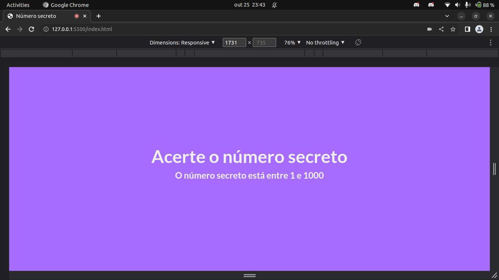
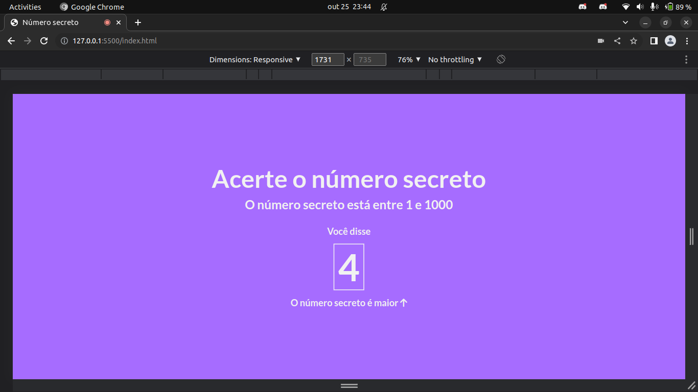
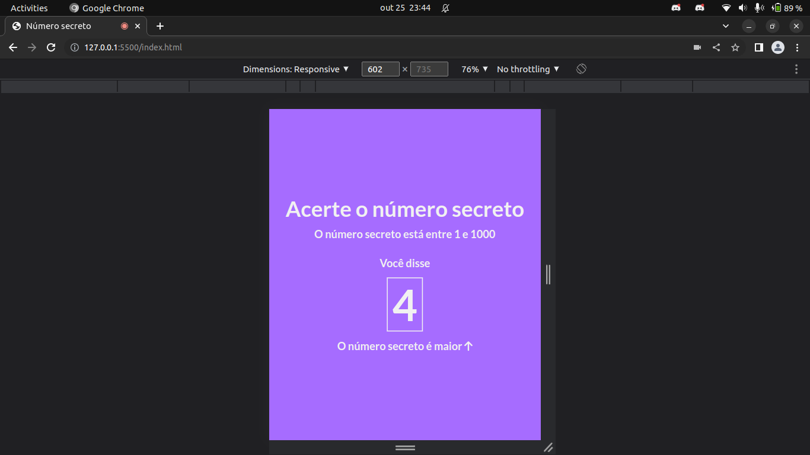
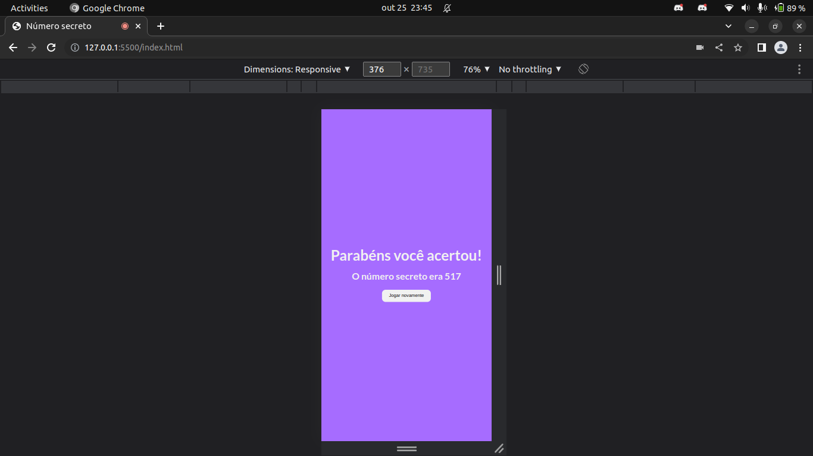

# numero-secreto

Neste projeto a proposta é criar um jogo de acertar o número sorteado usando sua voz, e o javascript irá nos ajudar nessa construção, aqui eu faço uso de validações, funçãos build-in, reconhecimento de voz, manipulação de dados, eventos e elementos, e para fazer tudo isso eu uso o javascript.

Acesse agora a <a href="https://numero-secreto-pied.vercel.app/">demo</a> e confira o deplay desse projeto 🚀.

## Tecnologias utilizadas 🛠️
*  HTML5
*  CSS3
*  JAVASCRIPT

## Funcionalidades do projeto
1. [x] Usar fala para tentar acertar o número secreto 
2. [x] Validar se o usuário falou um número negativo
3. [x] Validar se o usuário falou um valor inválido
4. [x] Sortear um número secreto aleatório entre 1 e 1000
5. [x] Indicar o usuário com uma seta se o valor do número secreto é maior ou menor
6. [x] Tela de sucesso ao usuário acertar o número secreto
7. [x] Continuar com o reconhecimento de fala até que acerte o número secreto
8. [x] Após acertar o número secreto aparece um botão para iniciar o jogo novamente
9. [x] Construção do layout mobile
10. [ ] Encerrar o jogo após o usuário falar GAME OVER

## Imagens do projeto
* 
Imagem Desktop

* 
Imagem Tablet

* 
Imagem Mobile

## Nota importante ⚠️

Esse projeto é recomendável ser executado no browser Google Chrome por ser 100% compatível com Web Speech API. Você pode usar nos demais browsers com exceção apenas do Mozilla Firefox.

## Status do projeto

🚧 Em construção 🚧

